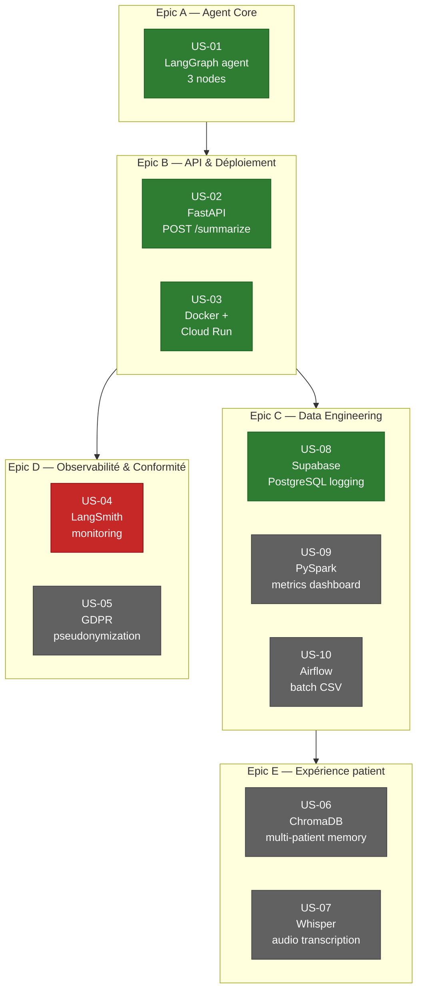

# Roadmap — Vue par epic

**Epic C — Data Engineering** est l'epic à prioriser pour la montée en
compétences visée (Airflow via US-10, PySpark via US-09) : c'est celui qui
transforme le projet d'un "projet perso" en démonstrateur "à l'échelle
hospitalière" sur un CV Data Engineer.

**Légende** : 🟢 Done · ⚪ Todo · 🔴 Blocked
