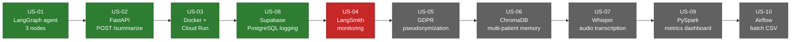

# Roadmap — Vue chronologique

Ordre de réalisation des User Stories, US-01 → US-10.

```mermaid
graph LR
    US01["US-01<br/>LangGraph agent<br/>3 nodes"]:::done
    US02["US-02<br/>FastAPI<br/>POST /summarize"]:::done
    US03["US-03<br/>Docker +<br/>Cloud Run"]:::done
    US08["US-08<br/>Supabase<br/>PostgreSQL logging"]:::done
    US04["US-04<br/>LangSmith<br/>monitoring"]:::blocked
    US05["US-05<br/>GDPR<br/>pseudonymization"]:::todo
    US06["US-06<br/>ChromaDB<br/>multi-patient memory"]:::todo
    US07["US-07<br/>Whisper<br/>audio transcription"]:::todo
    US09["US-09<br/>PySpark<br/>metrics dashboard"]:::todo
    US10["US-10<br/>Airflow<br/>batch CSV"]:::todo

    US01 --> US02 --> US03 --> US08 --> US04 --> US05 --> US06 --> US07 --> US09 --> US10

    classDef done fill:#2e7d32,stroke:#1b5e20,color:#fff
    classDef todo fill:#616161,stroke:#424242,color:#fff
    classDef blocked fill:#c62828,stroke:#8e0000,color:#fff
```

**Légende** : 🟢 Done · ⚪ Todo · 🔴 Blocked (US-04 — erreur 403 sur le token LangSmith)
